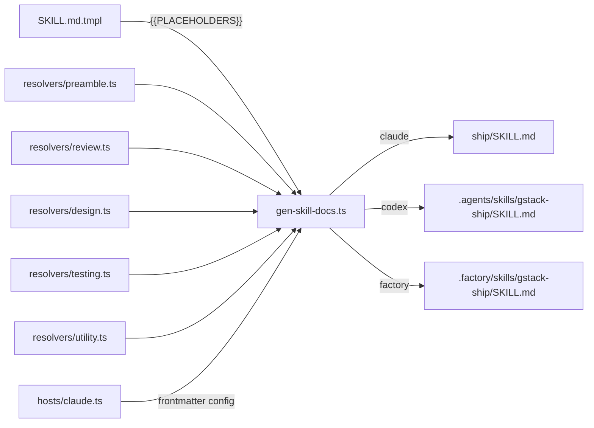
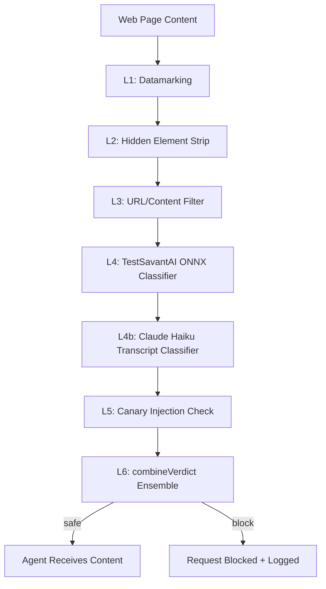
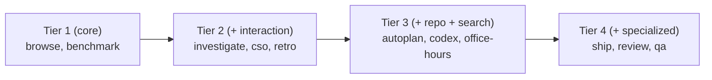

# 01-architecture-map.md — gstack

## High-Level Architecture

```
┌─────────────────────────────────────────────────────────────────┐
│                        CLAUDE CODE SESSION                       │
│                                                                  │
│   User types /ship, /review, /investigate, etc.                 │
│   Claude reads the corresponding SKILL.md prompt                │
│   Claude executes workflow steps using its tools                 │
└────────────────────────┬────────────────────────────────────────┘
                         │ Claude's tools include:
                         │ Bash, Read, Edit, Write, Agent
                         │
          ┌──────────────▼──────────────┐
          │      BROWSE DAEMON          │
          │   (browse/src/server.ts)    │
          │                             │
          │  Bun HTTP server            │
          │  127.0.0.1:LOCAL            │ ◄── Claude runs $B <cmd>
          │  127.0.0.1:TUNNEL ──────────┼──► ngrok ──► remote agent
          │                             │
          │  Persistent Chromium        │
          │  via Playwright             │
          │                             │
          │  Security layers L1-L6      │
          └─────────────────────────────┘
                         │
          ┌──────────────▼──────────────┐
          │   CHROMIUM BROWSER          │
          │   (headed or headless)      │
          │                             │
          │   Chrome Extension          │
          │   (if headed mode)          │
          │   Sidebar chat UI           │
          └─────────────────────────────┘
```

## Runtime Components

```
Runtime Process Tree:
├── claude (Claude Code binary)
│   ├── reads SKILL.md into context
│   ├── runs Bash commands ($B browse commands)
│   └── optionally spawns claude -p (test sessions)
├── browse server (Bun HTTP daemon, detached)
│   ├── local listener 127.0.0.1:PORT (full surface)
│   ├── tunnel listener 127.0.0.1:TUNNEL_PORT (allowlisted)
│   ├── Playwright-managed Chromium subprocess
│   └── sidebar-agent subprocess (in headed mode)
└── ngrok (optional, for pair-agent tunnel)
```

## Key Modules / Packages / Directories

| Module | Path | Role |
|--------|------|------|
| CLI entrypoint | `browse/src/cli.ts` | Command dispatch, server lifecycle |
| HTTP server | `browse/src/server.ts` | Request handling, security, Chromium management |
| Command registry | `browse/src/commands.ts` | READ (13), WRITE (20), META (17) commands |
| Snapshot engine | `browse/src/snapshot.ts` | ARIA tree → @ref-annotated text |
| Browser manager | `browse/src/browser-manager.ts` | Playwright page/tab management |
| Security orchestrator | `browse/src/security.ts` | ML classifiers + canary + verdict combiner |
| Content security | `browse/src/content-security.ts` | Datamarking, DOM strip, URL blocklist |
| Tunnel denial log | `browse/src/tunnel-denial-log.ts` | Async JSONL auth failure logging |
| Host registry | `hosts/index.ts` | 10 AI agent host configs |
| Skill doc generator | `scripts/gen-skill-docs.ts` | .tmpl → SKILL.md pipeline |
| Preamble composer | `scripts/resolvers/preamble.ts` | Tier 1-4 instruction assembly |
| Resolver library | `scripts/resolvers/*.ts` | 19 modules providing {{PLACEHOLDER}} content |
| Worktree manager | `lib/worktree.ts` | Isolated git worktrees for testing |
| Session runner | `test/helpers/session-runner.ts` | claude -p subprocess invocation |
| LLM judge | `test/helpers/llm-judge.ts` | Quality scoring via Anthropic SDK |
| Eval store | `test/helpers/eval-store.ts` | Result persistence + comparison |
| Touchfiles | `test/helpers/touchfiles.ts` | Diff-based test selection |
| Skill parser | `test/helpers/skill-parser.ts` | $B command extraction/validation |

## Control Flow

```
User Input → Claude reads SKILL.md → Claude executes workflow:
  Step 1: Shell commands via Bash tool
  Step 2: Browse commands via $B alias → HTTP POST → server.ts → Playwright
  Step 3: File reads/edits via Read/Edit tools
  Step 4: Spawned subagents for parallel review (Agent tool)
  Step 5: Output/decisions written back to workspace
```

## Data Flow

```
Browser Data Flow:
  $B <cmd>
    → cli.ts: parse args, acquire lock if first run, start server
    → HTTP POST 127.0.0.1:PORT/command {cmd, args, token}
    → server.ts: authenticate, route to handler
    → handler: Playwright API call → page state
    → content-security.ts: strip hidden DOM, apply datamarks
    → security.ts: ML classification (if content output)
    → JSON response → cli.ts stdout → Claude context

Skill Generation Flow:
  Edit SKILL.md.tmpl
    → bun run gen:skill-docs
    → gen-skill-docs.ts: read .tmpl, extract frontmatter
    → resolveTemplate(): find {{PLACEHOLDERS}}, call resolver functions
    → resolvers/*.ts: generate section content (preamble, review specs, etc.)
    → transformFrontmatter(): host-aware YAML transforms
    → Write SKILL.md for each configured host
    → (optionally) generate metadata sidecar files

Eval Flow:
  bun run test:evals
    → touchfiles.ts: git diff → select affected tests
    → session-runner.ts: spawn claude -p with test prompt
    → claude -p: reads SKILL.md, runs workflow
    → session-runner.ts: parse NDJSON → SkillTestResult
    → llm-judge.ts: score output via Anthropic SDK
    → eval-store.ts: persist result to ~/.gstack/projects/$SLUG/evals/
    → eval-compare.ts: compare with previous run
```

## Startup Path / Entrypoints

### Browse Daemon Startup
```
User runs: $B goto https://example.com
  cli.ts: readState()        — check ~/.gstack/browse.json
  cli.ts: isServerHealthy()  — HTTP GET /health (2s timeout)
  [if unhealthy]: acquireServerLock()  — atomic file lock (wx flag)
  cli.ts: startServer()      — Bun.spawn (Unix) or child_process (Windows)
  server.ts: Bun.serve({port: random(10000-60000)})
  server.ts: Playwright.launch()  — Chromium process
  server.ts: writeState()    — atomically write ~/.gstack/browse.json
  cli.ts: health check loop  — retry GET /health up to 30s
  cli.ts: runCommand()       — POST /command to running server
```

### Skill Installation
```
./setup
  Phase 1: Build binary (bun build --compile browse/src/cli.ts → browse/dist/browse)
  Phase 2: Link skills
    link_claude_skill_dirs() → ~/.claude/skills/ (real dirs + SKILL.md symlinks)
  Phase 3: Run version migrations from gstack-upgrade/migrations/
```

## Important Configuration Files

| File | Purpose |
|------|---------|
| `package.json` | Build scripts, dependency versions |
| `hosts/*.ts` | Per-AI-agent distribution config (10 hosts) |
| `scripts/jargon-list.json` | Terms auto-glossed in preamble |
| `~/.gstack/config.yaml` | Runtime user config (skill_prefix, team_mode, explain_level) |
| `~/.gstack/browse.json` | Running server state (pid, port, token, startedAt) |
| `~/.gstack/security/session-state.json` | Cross-process security state |
| `actionlint.yaml` | GitHub Actions lint config |
| `slop-scan.config.json` | AI code quality scanner config |
| `conductor.json` | Conductor workspace config |

## Dependency Graph at Subsystem Level

```
SKILL.md (runtime)
  └─ depends on: SKILL.md.tmpl + all resolver modules

gen-skill-docs.ts (build-time)
  └─ depends on: hosts/index.ts, scripts/resolvers/index.ts

scripts/resolvers/
  └─ depends on: jargon-list.json, hosts/*.ts (for host-aware content)

browse/src/server.ts
  └─ depends on: Playwright, security.ts, content-security.ts, commands.ts

browse/src/cli.ts
  └─ depends on: server.ts (via HTTP), ~/.gstack/browse.json

test/
  └─ depends on: session-runner.ts → claude binary
  └─ depends on: llm-judge.ts → Anthropic SDK
  └─ depends on: touchfiles.ts → git diff
  └─ depends on: eval-store.ts → ~/.gstack/projects/

setup (installation)
  └─ depends on: bun, Playwright, hosts/*, gen-skill-docs.ts
```

## Where State Lives

| State Type | Storage | Scope |
|------------|---------|-------|
| Server PID/port/token | `~/.gstack/browse.json` | Per-user, per-session |
| User preferences | `~/.gstack/config.yaml` | Per-user, persistent |
| Eval results | `~/.gstack/projects/$SLUG/evals/` | Per-project, persistent |
| Security attacks | `~/.gstack/security/attempts.jsonl` | Per-user, rotates at 10MB |
| Security session | `~/.gstack/security/session-state.json` | Per-session |
| ML model cache | `~/.gstack/models/` | Per-user, persistent (~112MB+) |
| Git worktrees | `/tmp/gstack-worktrees/` (inferred) | Ephemeral (test only) |
| Learnings | `~/.gstack/learnings/` (inferred) | Per-project, persistent |
| Version history | `~/.gstack/.last-setup-version` | Per-user, persistent |

## Where Prompts / Instructions / Rules / Skills Live

```
Skill prompts (what Claude reads):
  <skill>/SKILL.md                — generated, multi-host capable
  <skill>/SKILL.md.tmpl           — source template (hand-authored)

Shared prompt sections (resolver outputs):
  scripts/resolvers/preamble.ts   — tier-based preamble assembly
  scripts/resolvers/review.ts     — CEO/Eng/Design/DX review content
  scripts/resolvers/design.ts     — design audit checklist
  scripts/resolvers/testing.ts    — test framework detection
  scripts/resolvers/utility.ts    — shared utility sections
  scripts/resolvers/preamble/*.ts — 22 specific preamble generators

Behavioral philosophy:
  ETHOS.md                        — "Boil the Lake", "Search Before Building"

Jargon auto-glossing:
  scripts/jargon-list.json        — baked into preamble at gen time
```

## Where Tool Integrations Happen

| Tool | Integration Point |
|------|------------------|
| **Playwright** | `browse/src/browser-manager.ts`, `browse/src/server.ts` |
| **Anthropic API** | `test/helpers/llm-judge.ts`, `browse/src/server.ts` (sidebar) |
| **ONNX ML models** | `browse/src/security-classifier.ts` |
| **ngrok** | `browse/src/cli.ts` (pair-agent, tunnel commands) |
| **Supabase** | `supabase/functions/` (backend), `bin/gstack-telemetry-sync` |
| **GPT Image API** | `design/src/` |
| **Codex CLI** | `codex/SKILL.md.tmpl` (invoked as shell subprocess) |
| **Git** | `lib/worktree.ts`, `bin/gstack-diff-scope`, many skill templates |
| **GitHub Actions** | `.github/workflows/` (CI) |

## Where Memory / Context Is Persisted or Derived

- **Cross-session learnings**: `~/.gstack/learnings/` (inferred from `bin/gstack-learnings-log` and `scripts/resolvers/learnings.ts`)
- **Eval trend analysis**: `~/.gstack/projects/$SLUG/evals/` (structured JSON, versioned schema)
- **User question preferences**: `bin/gstack-question-preference` + `scripts/resolvers/question-tuning.ts`
- **Telemetry/analytics**: `bin/gstack-telemetry-log` → Supabase (inferred)
- **Security state**: `~/.gstack/security/session-state.json` (shared between server.ts and sidebar-agent.ts)
- **Git worktree dedup**: `lib/worktree.ts` dedup index (persistent hash tracking)

## Where Human Control Points Exist

1. **Skill invocation**: User types `/skill-name` — human initiates every workflow
2. **Ship workflow stops**: `/ship` only pauses for merge conflicts, failing tests, VERSION bump approval, plan items not done
3. **Review questions**: `AskUserQuestion` tool — agent surfaces ambiguous decisions
4. **CLAUDE.md guardrails**: Community PR rules (never auto-accept ETHOS.md edits, voice changes, YC promotion removal)
5. **`--no-verify` never used**: Git hooks always run unless user explicitly requests bypass
6. **Codex skill**: Boundary instruction prevents reading `~/.claude/` or `.gstack/` skill definitions
7. **Security kill switch**: `GSTACK_SECURITY_OFF=1` — human-controlled emergency bypass

## Architecture Diagrams

### Skill Template Compilation Pipeline



### Browse Daemon Security Layers



### Preamble Tier Composition


